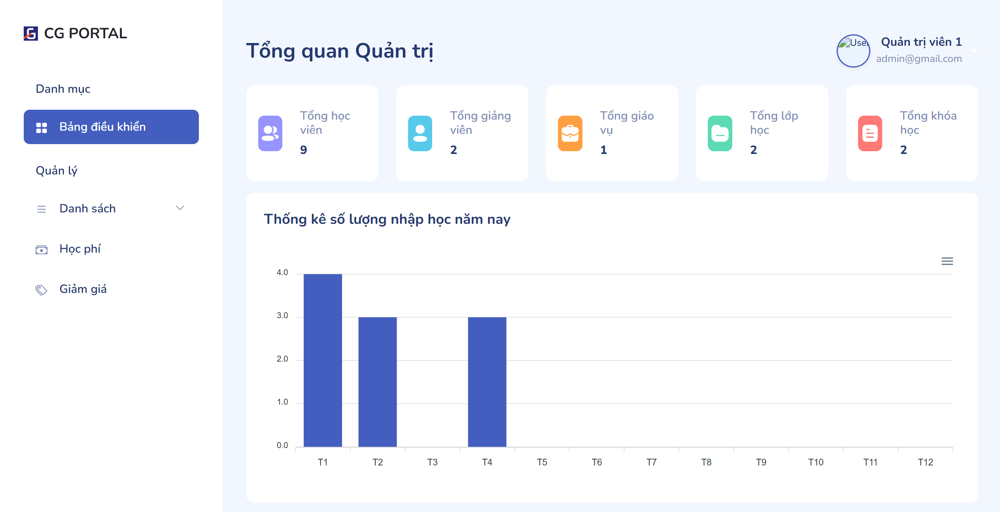

<h1 align="center">Quản Lý Trung Tâm (Center Management)</h1>

<p align="center">
  <i>Một hệ thống quản lý trung tâm giáo dục được xây dựng bằng Spring Boot & Thymeleaf.</i>
</p>

## 📸 Giao diện ứng dụng (Screenshots)



## 🚀 Tính năng nổi bật (Features)

- 🔒 **Authentication & Authorization**: Phân quyền chi tiết cho Admin, Giảng viên (Lecturer), Giáo vụ (Ministry) và Học viên (Student).
- 👩‍🏫 **Quản lý Lớp học & Khóa học**: CRUD toàn diện cho Lớp học, Bài giảng.
- 💰 **Quản lý Học phí (Tuition)**: Theo dõi trạng thái thanh toán, nhắc nhở đóng học phí.
- 🎁 **Mã giảm giá (Discount)**: Áp dụng các chính sách khuyến mãi khóa học.
- 📊 **Dashboard Thống kê**: Trực quan hóa dữ liệu người dùng và doanh thu.

## 🛠️ Công nghệ sử dụng (Tech Stack)

- **Backend:** Java, Spring Boot, Spring MVC, Spring Security, Hibernate/JPA.
- **Frontend:** HTML, CSS, JavaScript, Bootstrap, Thymeleaf (Server-side rendering), TinyMCE (Rich Text Editor).
- **Database:** MySQL / PostgreSQL.

## ⚙️ Hướng dẫn cài đặt (Local Setup)

1. **Clone repository:**

   ```bash
   git clone https://github.com/pmt1841/center-management.git
   cd center-management
   ```

2. **Cấu hình Môi trường (Environment Variables):**
   - Sao chép file `.env.example` thành `.env`:

     ```bash
     cp .env.example .env
     ```

   - Mở file `.env` và cập nhật các thông tin cấu hình của bạn (Database, Supabase, Gmail SMTP).
   - *Lưu ý:* Database sẽ được tự động tạo nếu chưa tồn tại, bạn không cần phải tạo thủ công.

3. **Chạy ứng dụng:**
   - Chạy thông qua IDE (IntelliJ IDEA / Eclipse) hoặc dùng Maven / Gradle:

   ```bash
   # Nếu bạn dùng Maven
   mvn spring-boot:run
   
   # Nếu bạn dùng Gradle
   ./gradlew bootRun
   ```

   - Truy cập vào: `http://localhost:8080`
