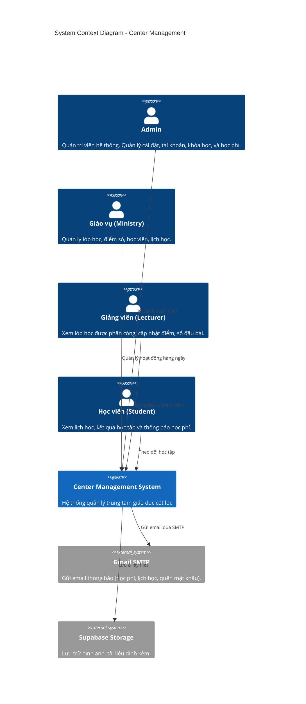
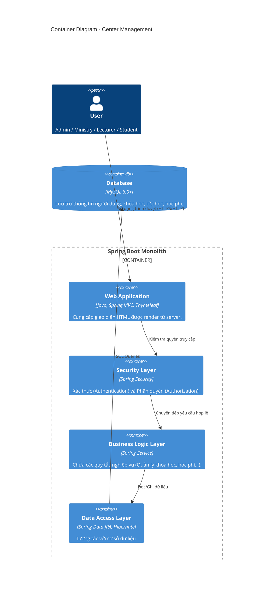

# Architecture Documentation

Dự án **Center Management** được thiết kế theo kiến trúc Monolith (nguyên khối) kết hợp với Server-Side Rendering (SSR) sử dụng Thymeleaf, Spring Boot và cơ sở dữ liệu MySQL.

## 1. System Context Diagram (C4 Model)
Sơ đồ dưới đây mô tả ngữ cảnh hệ thống, cách người dùng tương tác với hệ thống Quản Lý Trung Tâm.

## 2. Container Diagram
Kiến trúc bên trong của hệ thống Monolith.

## 3. Code & Component Architecture
Trong Spring Boot, dự án áp dụng mô hình thiết kế **Layered Architecture**:

1. **Controller Layer (`com.codegym.controller.*`)**:
   - Nhận HTTP Request từ client.
   - Trả về các file giao diện `.html` (Thymeleaf templates) hoặc chuyển hướng (Redirect).
   
2. **Service Layer (`com.codegym.service.*`)**:
   - Đảm nhận toàn bộ Business Logic.
   - Transaction Management (quản lý giao dịch) thông qua `@Transactional`.

3. **Data Access Layer (`com.codegym.repository.*`)**:
   - Sử dụng các Interface kế thừa `JpaRepository`.
   - Sinh các câu query tự động hoặc custom query bằng `@Query`.

4. **DTO & Mapping (`com.codegym.dto.*`, `com.codegym.mapper.*`)**:
   - Sử dụng **MapStruct** để map giữa Entity (Database) và DTO (Data Transfer Object).
   - Tách biệt dữ liệu Database ra khỏi Controller/View để bảo mật và dễ format.

## 4. Công nghệ bảo mật (Security Architecture)
- Sử dụng **Spring Security 6** (tương thích với Spring Boot 3.x/4.x).
- Session-based Authentication: Lưu trữ phiên đăng nhập.
- Phân quyền theo Role-based Access Control (RBAC): `ROLE_ADMIN`, `ROLE_MINISTRY`, `ROLE_LECTURER`, `ROLE_STUDENT`.
- Mật khẩu được mã hóa một chiều bằng `BCryptPasswordEncoder`.

## 5. Xử lý ngoại lệ (Exception Handling)
- **Global Controller Advice**: Sử dụng `@ControllerAdvice` để gom tất cả exception (như `NotFoundException`, `AccessDeniedException`) về một nơi và trả về trang báo lỗi thân thiện (404, 403, 500) thay vì stack trace thô.
